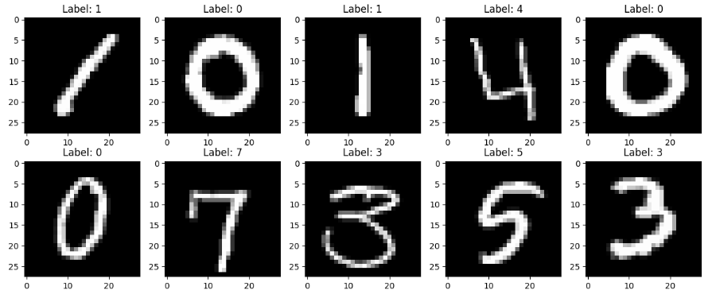

# Digit Recognizer

A computer vision project built on the [Kaggle Digit Recognizer competition](https://www.kaggle.com/competitions/digit-recognizer) to classify handwritten digits from the classic MNIST dataset.



## Project Overview

This project explores multiple approaches to image classification, starting from a traditional machine learning baseline and progressively moving toward deep learning with Convolutional Neural Networks (CNNs).

## Project Structure
```
Digit-Recognizer/
├── notebooks/
│   ├── 01_data_exploration.ipynb      # Dataset analysis and visualization
│   └── 02_baseline_model.ipynb        # Random Forest baseline + Kaggle submission
└── models/                            # Saved model weights
```          


## Approaches & Results

| Approach | Validation Accuracy
|---|---|
| Random Forest (baseline) | ~96% | 


## Tech Stack

- Python
- NumPy / Pandas
- Matplotlib / Seaborn
- Scikit-learn

## How to Run

**1. Clone the repository**
```bash
git clone https://github.com/YOUR_USERNAME/Computer-Vision-Playground.git
cd Computer-Vision-Playground/Digit-Recognizer
```

**2. Install dependencies**
```bash
pip install numpy pandas matplotlib seaborn scikit-learn torch torchvision jupyter
```

**3. Download the data**

Create a Kaggle account, get your API token and run:
```bash
kaggle competitions download -c digit-recognizer
```
For windows:
```bash
tar -xf digit-recognizer.zip -C data/ 
```
**4. Launch Jupyter**
```bash
jupyter notebook
```
